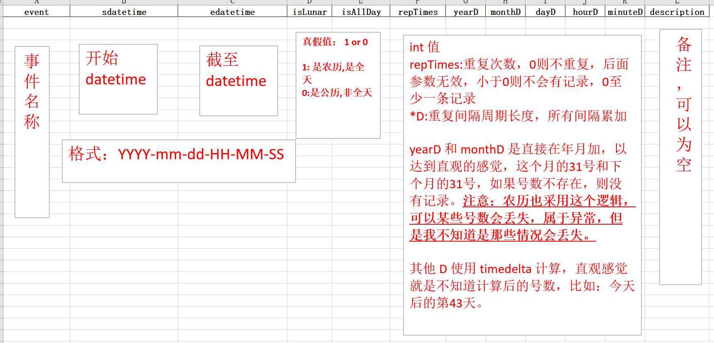
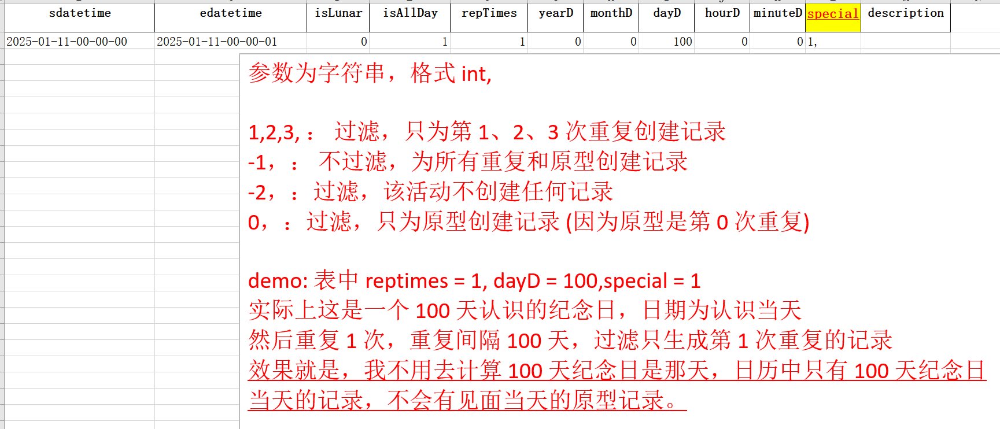

先初始化实例

调用 write_demo 生成模板文件

填写模板

调用 convert_excel 将 excel 转为 ics 文件

填写表格说明：

# 更新 2025/1/16 21:34

修正：
- 错误
- 命名规范

增加:
- 现在调用脚本需要传递参数
    1. -t: 当前文件夹生成一个模板
    1. -a: 为当前文件夹下的所有  xlsx 生成 ics
    1. -f: 跟 xlsx 列表，为传递的 xlsx 文件生成 ics

- 模板中新加一个 column，见下面截图

